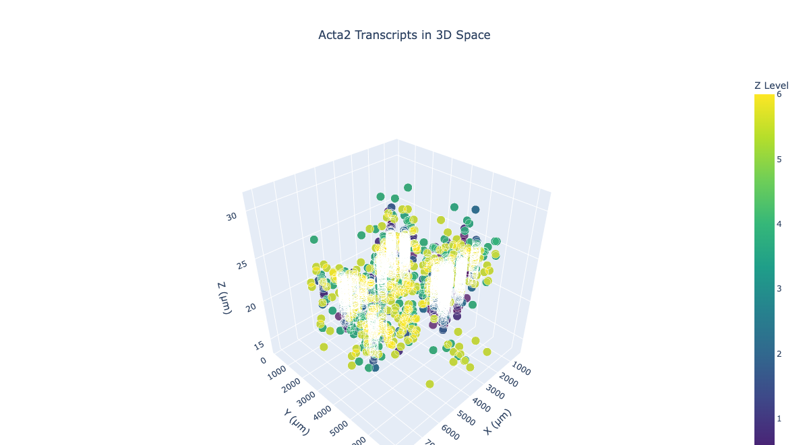
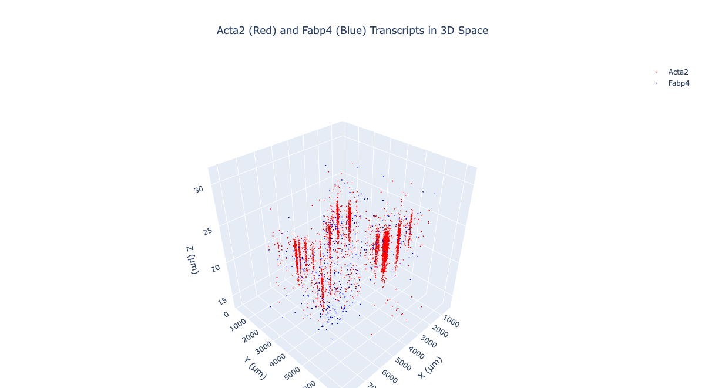
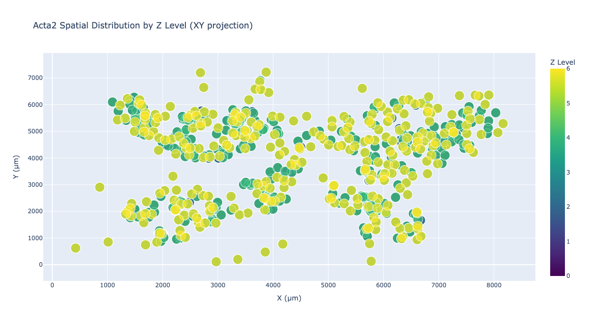
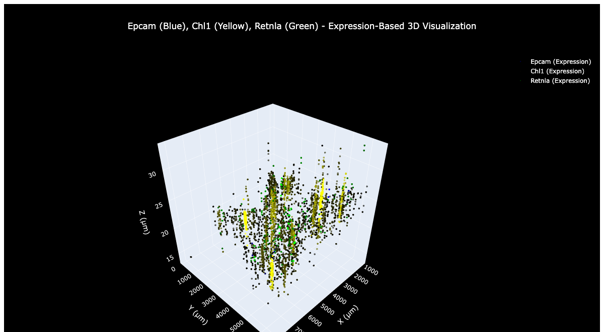
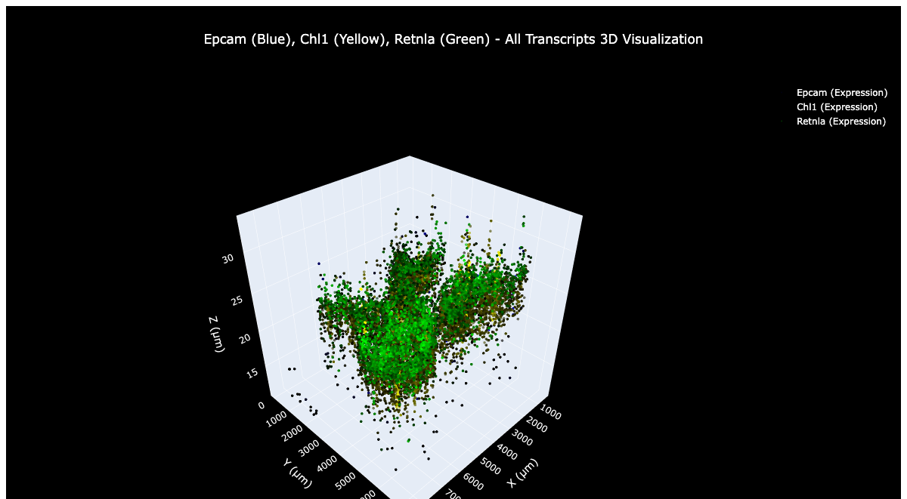

# Environmental Health Analysis: Pancreatic Cancer & Pancreatitis

## Project Overview
This project analyzes the relationship between environmental factors (AQI, water quality, zip code demographics) and pancreatic cancer/pancreatitis incidence using SEER data and environmental exposure datasets.

## Key Visualizations

### 3D Spatial Analysis

*3D spatial distribution of ACTA2 gene expression across tissue samples*


*Combined ACTA2 and FABP4 gene expression in 3D space*

### Expression Analysis

*Density heatmap showing ACTA2 gene expression patterns*


*Overlay visualization of multiple gene expressions*

### Spatial Distribution

*Geographic distribution of gene expression across tissue regions*


*Spatial analysis across different z-levels (depth layers)*

### Advanced Analysis

*3D visualization with expression filtering applied*


*Comprehensive 3D analysis of all transcript data*

## Project Structure
```
├── data/                    # Data storage
│   ├── raw/                # Raw downloaded data
│   ├── processed/          # Cleaned and processed data
│   └── results/            # Analysis outputs
├── src/                    # Source code
│   ├── data_acquisition/   # Data collection modules
│   ├── data_processing/    # Data cleaning and preprocessing
│   ├── analysis/           # Statistical analysis modules
│   └── visualization/      # Plotting and visualization
├── notebooks/              # Jupyter notebooks for exploration
├── config/                 # Configuration files
├── requirements.txt        # Python dependencies
└── main.py                # Main execution script
```

## Key Features
- **Multi-source data integration**: SEER, EPA AQI, water quality, demographic data
- **Hotspot analysis**: Identifies pancreatic cancer hotspots associated with air quality
- **Spatial analysis**: Geographic correlation between environmental factors and health outcomes
- **Temporal analysis**: Time-series analysis of exposure and incidence patterns
- **Statistical modeling**: Regression, spatial clustering, and machine learning approaches
- **Interactive visualizations**: Maps, time series plots, and correlation matrices
- **Real data only**: No mock data - requires actual data downloads

## Data Sources
1. **SEER Cancer Data**: Pancreatic cancer incidence and mortality
2. **EPA Air Quality Index**: County-level air pollution data
3. **EPA Water Quality Data**: Drinking water contaminant levels
4. **Census Demographics**: Zip code level socioeconomic factors
5. **CDC Wonder**: Additional health statistics

## Analysis Pipeline
1. **Data Acquisition**: Download real data from SEER, EPA, and Census sources
2. **Data Cleaning**: Standardization, missing value handling
3. **Hotspot Analysis**: Identify pancreatic cancer hotspots associated with air quality
4. **Spatial Alignment**: Geographic matching across datasets
5. **Statistical Analysis**: Correlation, regression, clustering
6. **Visualization**: Interactive maps and plots
7. **Reporting**: Automated report generation

## Usage
```bash
# Install dependencies
pip install -r requirements.txt

# Check data requirements and download instructions
python download_real_data.py

# Run complete analysis (requires real data)
python main.py

# Run hotspot analysis only
python run_hotspot_analysis.py

# Run specific modules
python src/data_acquisition/seer_downloader.py
python src/analysis/hotspot_analysis.py
```

## Outputs
- **Interactive maps**: Geographic distribution of cancer rates and environmental factors
- **Statistical reports**: Correlation coefficients, p-values, effect sizes
- **Time series plots**: Temporal trends in exposure and incidence
- **Machine learning models**: Predictive models for risk assessment
